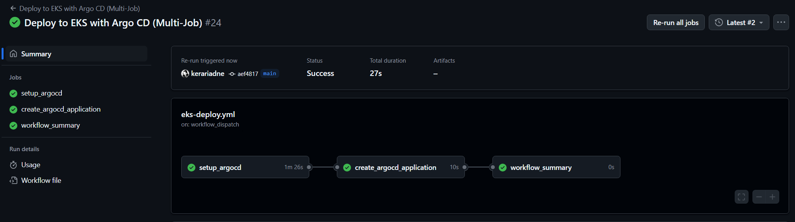
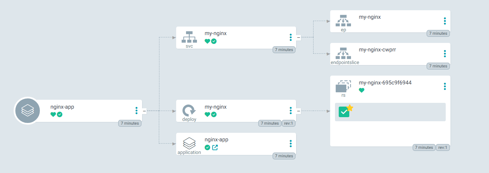
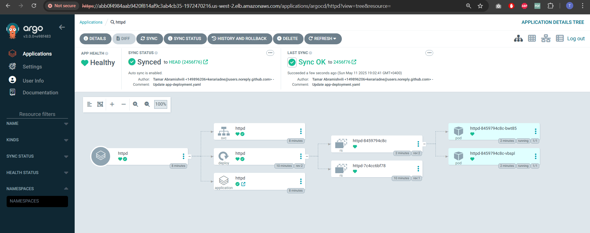
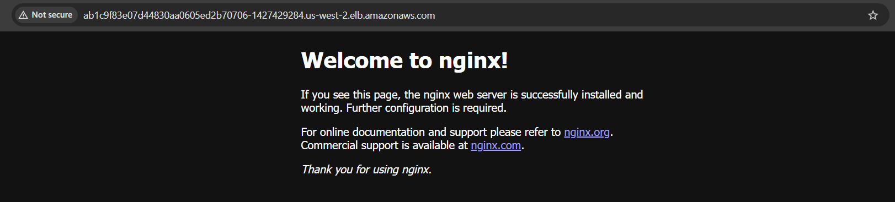

# 🚀 GitOps on AWS EKS with ArgoCD, GitHub Actions & Nginx

This project showcases a complete GitOps workflow for deploying and managing an Nginx web server on Amazon Web Services (AWS) Elastic Kubernetes Service (EKS). The entire process, from infrastructure provisioning (ArgoCD setup) to application deployment, is orchestrated by ArgoCD, with GitHub Actions facilitating the initial setup and continuous synchronization based on GitOps principles.

## 🌟 Core Concepts Demonstrated

*   **Git as the Single Source of Truth:** All configurations for the EKS cluster, ArgoCD, and the Nginx application reside in this Git repository.
*   **Declarative Configuration:** Kubernetes manifests define the desired state of the application and infrastructure.
*   **Continuous Synchronization:** ArgoCD continuously monitors the Git repository and automatically applies any changes to the EKS cluster.
*   **Automated CI/CD Pipeline:** GitHub Actions are used to:
    *   Bootstrap the EKS cluster with ArgoCD.
    *   Configure ArgoCD to manage the Nginx application.
    *   (Potentially) Automate further operational tasks.

## 🔧 Tools & Technologies Leveraged

*   **AWS EKS (Elastic Kubernetes Service):** Managed Kubernetes service on AWS.
*   **ArgoCD:** Declarative GitOps continuous delivery tool for Kubernetes.
*   **GitHub Actions:** CI/CD and automation platform integrated with GitHub.
*   **Kubernetes:** Container orchestration platform.
*   **Nginx:** High-performance web server (used as the demo application).
*   **Git:** Distributed version control system.
*   **YAML:** Data serialization language for Kubernetes manifests and configurations.
*   **AWS CLI & `kubectl`:** Command-line tools for interacting with AWS and Kubernetes.

## 📁 Key Project Files & Structure
.
├── .github/workflows/ # GitHub Actions workflows
│ └── eks-deploy.yaml # Workflow for ArgoCD setup & app deployment
├── EKS_Cluster/ # Kubernetes manifests for the Nginx application
│ ├── app-deployment.yaml # Defines the Nginx Deployment
│ └── app-service.yaml # Exposes Nginx via a LoadBalancer
└── argocd-app.yaml # ArgoCD Application manifest to manage Nginx

*   **`.github/workflows/eks-deploy.yaml`:** This GitHub Actions workflow automates:
    *   Configuring AWS credentials.
    *   Connecting to the EKS cluster (`gitops-cluster`).
    *   Installing ArgoCD into the `argocd` namespace.
    *   Exposing the ArgoCD server UI via a LoadBalancer.
    *   Securing ArgoCD by changing the initial admin password.
    *   Deploying the `argocd-app.yaml` manifest, which instructs ArgoCD to manage the Nginx application from the `EKS_Cluster/` path in this repository.
*   **`EKS_Cluster/app-deployment.yaml`:** Kubernetes Deployment manifest for the Nginx application, specifying the image, replicas, and other configurations.
*   **`EKS_Cluster/app-service.yaml`:** Kubernetes Service manifest of type `LoadBalancer` to expose the Nginx application to the internet.
*   **`argocd-app.yaml`:** ArgoCD `Application` Custom Resource Definition (CRD). This file tells ArgoCD:
    *   Which Git repository to monitor (`source.repoURL`).
    *   Which path within the repository contains the application manifests (`source.path`).
    *   The target Kubernetes cluster and namespace for deployment (`destination`).
    *   The synchronization policy (e.g., `automated: { prune: true, selfHeal: true }`).

## 🚀 Deployment & Workflow Overview

1.  **Prerequisites:**
    *   An AWS account with an EKS cluster named `gitops-cluster` (or modify `eks-deploy.yaml` accordingly).
    *   AWS credentials (`AWS_ACCESS_KEY_ID`, `AWS_SECRET_ACCESS_KEY`) configured as GitHub Secrets in your repository.
    *   A new admin password for ArgoCD (`ARGOCD_NEW_ADMIN_PASSWORD`) configured as a GitHub Secret.
2.  **Triggering the Workflow:** Pushing changes to the `main` branch (or as configured in `eks-deploy.yaml`) will trigger the GitHub Actions workflow.
3.  **GitHub Actions Execution (`eks-deploy.yaml`):**
    *   The workflow connects to AWS and the EKS cluster.
    *   It installs ArgoCD if not already present.
    *   It configures the ArgoCD server service to be of type `LoadBalancer`.
    *   It changes the ArgoCD initial admin password.
    *   It applies the `argocd-app.yaml` manifest to the cluster.
4.  **ArgoCD Takes Over:**
    *   Once `argocd-app.yaml` is applied, ArgoCD starts monitoring the specified Git repository path (`EKS_Cluster/`).
    *   It detects the Nginx manifests (`app-deployment.yaml`, `app-service.yaml`).
    *   It automatically syncs these manifests to the EKS cluster, deploying the Nginx application.
5.  **GitOps in Action:**
    *   Any subsequent changes pushed to the manifests in the `EKS_Cluster/` directory (e.g., updating the Nginx image version, changing replica count) will be automatically detected by ArgoCD.
    *   ArgoCD will then synchronize these changes to the EKS cluster, ensuring the live state matches the desired state defined in Git.

## 🌐 Accessing Services

*   **ArgoCD UI:** The GitHub Actions workflow will output the LoadBalancer DNS/IP for the `argocd-server` service. Access it via HTTPS. Log in with username `admin` and the password you set via `ARGOCD_NEW_ADMIN_PASSWORD`.
*   **Nginx Application:** Once ArgoCD has deployed the Nginx application, you can find the LoadBalancer DNS/IP for the `my-nginx` (or `my-httpd` if you changed it) service by running `kubectl get svc my-nginx -n default` (or the relevant namespace). Access it via HTTP in your browser.

## 📸 Screenshots

*(Consider adding screenshots here as you generate them during your master's thesis work. You can replace the placeholder links below with actual image paths once you have them, e.g., `./screenshots/my-image.png`)*

*   **GitHub Actions Workflow Success:**

*   **ArgoCD UI - Application Synced & Healthy:**

*   **ArgoCD UI - After an Update (e.g., Nginx to Httpd):**

*   **Deployed Nginx Application in Browser:**

## ✅ Project Status & Key Milestones Achieved

*   [✔] AWS EKS cluster prerequisites assumed/configured.
*   [✔] GitHub Actions workflow (`eks-deploy.yaml`) for automation created.
*   [✔] ArgoCD installation and initial secure configuration automated.
*   [✔] Nginx application manifests (`app-deployment.yaml`, `app-service.yaml`) created.
*   [✔] ArgoCD Application manifest (`argocd-app.yaml`) defined for GitOps management.
*   [✔] End-to-end GitOps pipeline successfully set up and demonstrated:
    *   Initial deployment of Nginx via ArgoCD triggered by GitHub Actions.
    *   Automatic application updates (e.g., image change from Nginx to Httpd) reflected in the cluster after Git commit, managed by ArgoCD.
